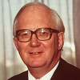
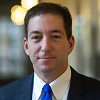
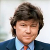

### A
||||
|---|---|---|
||Huma Abedin|American political staffer Traveling Chief of Staff and Asst. to Hillary Clinton during 2008 Democratic Party nomination campaign Deputy Chief of Staff to US Secretary of State, Hillary Clinton, 2009-2013 Vice Chair, Hillary Clinton 2016 US Presidential campaign|
||Aras Agalarov|Russian real-estate developer Father of Emin Agalarov|
||Emin Agalarov|Son of Russian real-estate developer Aras Agalorov Requested meeting with Trump team through Robert Goldstone|
||Zainab N. Ahmad|Mueller Probe Attorney|
||Rinat Akhmetshin||
||Madeleine Albright|Former US Secretary of State Cambridge Symposium Speaker, July 2016|
||Dimitri Alperovitch|Crowdstrike Founder|
||Heather Alpino|Mueller Probe Attorney|
||Peter Ammon|German Ambassador to the UK Camridge Symposium Speaker, July 2016|
||Sir Roy Anderson|Professor of Infectious Disease Epidemiology[1] Former Rector, Imperial College London[1] Hakluyt International Advisory Board[1] [1] HAK-WIKI-26SEP19|
||Trisha Anderson||
||Greg Andres|Mueller Probe Attorney|
||Shai Arbel|Former Israeli intelligence Runs Terrogence, used by CIA and FBI to monitor social media manipulation|
||Uzodinma (Uzo) Asonye|US Attorney District Court Eastern District of Virginia Deputy Chief Financials and Public Corruption Mueller Probe Attorney|
||Julian Assange|Wikileaks Founder|
||Sharyl Attkisson||
||Rush Atkinson||
### B
||||
|---|---|---|
||Gregory Baker|Military attaches at US Embassy in London Met George Papadopoulos and Terrance Dudley, 5-May-2016|
||James A. Baker|FBI|
||James H. Baker|Director, Office of Net Assessment, US DoD Directed intelligence operations of Stefan Halper|
||Steve Bannon|Trump 2016 Campaign|
||William Pelham Barr|US Attorney General|
||Edward Baumgartner|Hakluyt|
||Ksenia Baygarova|Interviewed Papadopoulos at Hilton, Mid-Town, NYC, Sep 2016|
||Joseph Robinette Biden|US Vice-President under Barack Obama|
||William Binney||
||Sidney Blumenthal||
||John O. Brennan|CIA Director under Barack Obama|
||Matthew Bryza|Former US Ambassador to Azerbaijan Opposes George Papadopoulos' ideas about middle eastern energy policy|
||Andrew Brown||
||Natalia Budaeva||
||John Buretta|American criminal defense lawyer Hired by Burisma to help address the case in Ukraine [BUR-SOLO-26SEP19]|
||Chris Burrous||
||Maria Butina||
### C
||||
|---|---|---|
||Christian Cantor|Israeli Embassy, London Acquaintance of George Papadopoulos Boyfriend of Erika Thompson in 2016 Introduced Papapdopoulos to Erika Thompson|
||Francesco Cappotto|CNAIPIC|
||Michael Caputo||
||John Carlin||
||Mike Carpenter|Foreign and defense policy advisor to Vice President Joe Biden (US)|
||Peter Carr||
||Ben Carson|2016 US Republican Presidential Candidate Housing and Human Affairs Secretary under Trump|
||Sara A. Carter|Journalist and Correspondent|
||Thomas Catan|Fusion GPS|
||Peter Cazalet 1929-2019|President, BP North America, 1972-1975 Deputy Chairman, British Petrolium Co. plc, 1981-1986 Led negotiations for a trans-Alaska pipeline Co-Founder, Hakluyt, 1995 (ret. 2000) Director, Holdingham International Advisory Board (see Hakluyt), 1997-2000 Director, Holdingham Group Ltd (see Hakluyt), 1998-1999|
||Alexandra Chalupa||
||Vitaly Ivanovich Churkin||
||James R. Clapper||
||Jonathan Clarke|Hakluyt Director US Operations Co-wrote "America Alone" and "The Silence of the Rational Center" with Stefan Halper Carnegie Council Senior Fellow, 2006-2009|
||Kevin Clinesmith|FBI Attorney Questions Papapdopoulos along with Heide and McSwain|
||Hillary Rodham Clinton||
||William Jefferson Clinton|US President, 1993-2001|
||Sam Clovis|Trump 2016 Campaign|
||Dan Coats|American politician and former diplomat US Senator from Indiana, 1989-1999 US Senator from Indiana, 2011-2017 Director of National Intelligence, 2017-2019|
||Michael Cohen|Former attorney for the Trump Organization Approached by FBI informant Felix Sater about building a Trump Tower in Moscow|
||James B. Comey|FBI Director under Barack Obama|
||Jeremy Connell|Attorney First Secretary HM Diplomatic Service Founder Director Hakluyt, 1995-|
||Giuseppe Conte||
||David Corn|Reporter for Mother Jones Reported a Trump "covert" relationship with Russia|
||Keith Robert Craig|Former undercover MI6 officer Wrote pseudonymous articles for Spectator from Bosnia, 1994 A principal shareholder of Hakluyt (98,508 chares at 23-Jul-2014|
||Charles Crawford|Former undercover MI6 officer Stationed at UK embassy in South Africa Teaches at London Academy o f Diplomacy (LAD) with Joseph Mifsud Taught seminar "Dealing with the Media" with Mifsud and Gianni Pittella Hakluyt|
||Sir Brian Cubbon 1928-2015|Permanent Secretary, Northern Ireland and Home Office Co-Founder Hakluyt, 1995|
### D
||||
|---|---|---|
||Rick Dearborn|Trump 2016 Campaign Advised and handled George Papadopoulos|
||Sir Richard Dearlove|MI6; Hakluyt Cambridge Symposium Speaker, July 2016|
||Giovanni De Gennaro||
||Diana Denman||
||Oleg Deripaska|Russian billionaire Employed Paul Manafort|
||Elizabeth Dibble|US Deputy Chief of Mission at US Embassy, London Possibly made contact with Alexander Downer while George Papadopoulos was in London|
||Ryan Kao Dickey|Mueller Probe Attorney|
||Alexander Downer|Australian diplomat 2006 Helped arrange $25M USD donation to Clinton Foundation for AIDS screening and treatment in Asia [DOW-SOLO-5MAR18] 2008-2014 High Commissioner in London Hakluyt Advisory Board [HAK-CARL-9MAY18] Met with George Papadopoulos and Erika Thompson in London|
||Michael Dreeben||
||Terrance Dudley|Miltary attache at US Embassy in London Meets with George Papadopoulos and Gregory Baker, 5-May-2016|
||Igor Dveykin|Russian intelligence officer Steele Dossier claims met with Carter Page|
||Scott Dworkin||
### E
||||
|---|---|---|
||Yasser El-Shemy|Egyptian Embassy, D.C. Introduced to Steve Bannon by Papadopoulos re: al-Sisi meeting with Trump, 2016|
||Eitan Eisenberg||
||Marc C. Elias|Attorney, Perkins Coie LLP Political Law Practice Head General Counsel, Kamala Harris 2020 Presidential Campaign|
||Francis Elliott|Times of London political editor |
||Tobias Ellwood|British Foreign Ministry Meets Papadopoulos in New York and asks a lot about Russia Opposes Trump support of Brexit|
||Boris Epshteyn||
### F
||||
|---|---|---|
||Evelyn Farkas||
||Diane Feinstein|US Senator, California Senate Intelligence Cmte Chair|
||Clarice Feldman||
||Lt. Gen. Michael T. Flynn|Director National Intelligence under Barack Obama Opposed Iran Nuclear Deal Support Donald Trump Presidential campaign|
||Kyle Freeny|Mueller Probe Attorney|
||Peter Fritsch|Fusion GPS|
### G
||||
|---|---|---|
||Michael Gaeta|FBI Special Agent|
||Christopher Gent|Managing Director Vodaphone UK, 1985 CEO Vodaphone, 1997 Director Hakluyt International Advisory Board, The Holdingham Group Advisory Board, 2004-2006 Chairman GlaxoSmithKline, 2005-|
||Paolo Gentiloni|Former Prime Minister of Italy, 2016-2018 Founding member of Italian Democratic Party|
||Gino Germani||
||Sir Paul Getty, KBE 1932-2003|Eugene Paul Getty Third of five sons of Jean Paul Getty Sr. (1892-1976) Awarded honorary knighthood, KBE, 1986 Became british citizen, 1997 Hakluyt|
||Michael Glassner|Trump Campaign Committed Executive Director|
||Andrew Daniel Goldstein|Mueller Probe Attorney|
||Robert Goldstone|British publicist Proposed the Trump Tower meeting to Donald Trump Jr. at the request of his client Emin Agalarov| 
||Jeffrey D. (J.D.) Gordon||
||Rhona Graff||
||Glenn Greenwald|Journalist and author|
||Rudy Giuliani|Rudolph William Louis Giuliani American politician, attorney, speaker Former New York City Mayor, 1994-2001|
||Trey Gowdy|Harold Watson "Trey" Gowdy III Former federal prosecutor Former Congressman for South Carolina District 4, 2011-2019|
### H
||||
|---|---|---|
||David Ha'ivri|Political Strategist Introduced Charles Tawil to George Papadopoulos|
||Stefan Halper|Former CIA Employee Policy advisor to Nixon, Ford and Reagan[HAK-CARL-9MAY18] Led Reagan campaign data-gathering operation to collect inside information on Carter foreign policy Close ties to G.W. Bush Son-in-law of Ray Cline, CIA Associate of Dearlove at Cambridge Directed Cambridge Security Initiative Hakluyt Co-authored two books with Jonathan Clarke, Hakluyt FBI Informant Met with Papadopoulos, Carter Page and Sam Clovis Cambridge Symposium Attendee, July 2016 Invites Papadopoulos to London to discus Leviathan, Sep 2016 Questions Papadopoulos about Russia|
||Sir Anthony Hammond|Hakluyt|
||Luke Harding|Hakluyt|
||Gina Haspel|CIA Director under Donald Trump|
||Curtis Heide|FBI Agent questioned Papapdopoulos along with Michael McSwain, 27 Jan 2017|
||Shawn Henry||
||Catherine Herridge|Reporter|
||Eric Holder|Eric Himpton Holder, Jr US Attorney General, 2009-2015|
||Peter Homes|Hakluyt|
||Hope Hicks|Trump 2016 Campaign Contacted by Interfax about interview with Papadopoulos|
||Lisa Holtyn||
||Michael Horowitz|US Justice Department Inspector General under Donald Trump|
||Mark Hubband|Journalist Hakluyt|
||Rupert Huxter|Hakluyt|
### I
||||
|---|---|---|
||Nagi Khalid Idris|Founder of EN Education Group Limited Founder of London Centre of Internaltional Law and Practice (LCILP) Offers George Papadopoulos a position at LCILP Introduces Papadopoulos to Arvinder Sambei and Joseph Mifsud|
||David Ignatius|Journalist Given information about Michael Flynn by FBI's James Baker|
||Lord Peter Inge|Hakluyt|
||Michael Isikoff|Reporter|
### J
||||
|---|---|---|
||Mary Jacoby|Wife of Glenn R. Simpson Fusion GPS|
||Christopher James|Hakluyt|
||Adam Jed||
||Earl Jellicoe|Hakluyt|
||George Jellicoe|Hakluyt|
||Larry C. Johnson|Writer/Reporter|
||Oded Joseph|Israeli National Security Council Forieng Policy Division Deputy|
### K
||||
|---|---|---|
||Panos Kammenos|Greek Defense Minister Wanted to discuss moving US nukes from Incirlik to Souda Bay, Crete Arranges meetings for Papadopoulos wiht Egyptian contacts|
||Fr. Alex Karloutsos|Head of Public Affairs, Greek Orthodox Archdiocese of America Close to Clintons Meets with Papadopoulos, Dec 2016|
||Kathleen A. Kavalec||
||Ike Kaveladze||
||Robert Kelner|Former Attorney for Flynn Intel Group Alleges Flynn set up by Jim Woolsey|
||Bridget Kendall|BBC Diplomatic Correspondent Master of Peterhouse College Cambridge Symposium Speaker, July 2016|
||Neil King Jr.||
||Adam Kinzinger||
||Martin Kohlhaussen|Hakluyt|
||Nikolaos Kotzias|Greek Foreign Minister Meets with Papadopoulos|
||David Kramer||
||Jared Kushner||
### L
||||
|---|---|---|
||Uzi Landau|Son of Haim Landau, Irgun Commander and leader of Herut PhD in engineering from MIT Worked as a system analyst before entering politics Knesset member in Likud, 1984-2006 Fired by Ariel Sharon for voting against Gaza disengagement Israel tourism minister [[Uzi Landau|Web+Resources#Uzi+Landau]]|
||Yigal Landau|Son of Yeshayahu (Shaikeh) Landau. Bsc Engineering, Technion, Haifa, Israel, 1982. MBA Tel Aviv Univ., 1986. CEO Hiram Landau Ltd., 1990-. Director and CEO, Ratio Oil Exploration, 1992-. Union Bank of Israel Board, 1993-. Director, Proseed Venture Capital Fund Ltd., 2001-. Director, "Dalia" Power Energies Ltd., 2005-2013. Proponent of Israel energy independence.|
||Brian Lanza|Trump 2016 Campaign Contacted by Interfax for interview with Papadopoulos|
||Patrick Lawrence||
||Talia Leibovich|Asst Deputy Chief of Mission US Embassy, Israel Asks Papadopoulos to beed Oded Joseph|
||Corey Lewandowski|Trump Campaign Manager|
||Avigdor Lieberman|Soviet-born Israeli politician Israeli Defense Minister 2016-2018|
||Edward Lieberman||
||Evelyn Lieberman||
||Dafna Linzer||
||Yuriy Lutsenko||
||Loretta Lynch|US Attorney General under Barack Obama|
### M
||||
|---|---|---|
||Sir Fitzroy MacLean 1911-1996|UK WWII hero, diplomat and author Former Member of Parliament CIA Senior Operations Officer Hakluyt Founder|
||Paul Manafort||
||Simona Mangiante||
||Iryna Mazur||
||Andrew McCabe||
||John McCain|US Senator, Arizona|
||Nadia McConnell||
||Donald McGahn|Attorney|
||Michael McSwain|FBI Agent Interviewed George Papadopoulos with Curtis Heide|
||Scott Meisler||
||Joseph Mifsud|"Maltese Professor" Offers Papapdopoulos a meeting between Trump and Putin Introduces Papadopoulos to "Olga Vinogradova", ostensibly Vladimir Putin's niece Tells Papadopoulos Russia has "dirt" on Hillary Clinton|
||Sergei Millian|FBI informant Connects with Papadopoulos about his Russian leadership connections Tells Papapdopoulos he knows Michael Cohen well Represented(?) Trump's real state project in Russia  Invites Papadopoulos to an energy conference in Moscow Offers Papapdopoulos PR work funded by unnamed Russian energy minister Tells Papadopoulos he met with John McCain and Mike Costache and another friend Identified by the Wall Street Journal as Siarhei Kukuts of Atlanta and New York, 24 Jan 2017 Source "D" and "E" in the Steele Dossier|
||Lukas Mikelionis||
||Stephen Miller|Trump 2016 Campaign|
||Cheryl Mills||
||Marco Minniti||
||Ernest Moniz|Former Obama Energy Secretary Meets George Papadopoulos at energy policy conference in Israel, 1-Apr-2016|
||Robert S. Mueller|Former FBI Director Special Prosecutor investigating "Russian Interference" in 2016 US Presidential election|
||Shailagh Murray||
### N
||||
|---|---|---|
||Jerold Nadler|US Representative House Judicial Cmte Chair|
||Alexander Nix||
||Victoria Nuland||
||Devin Nunes|US Representative Former Chairman, US House Intelligence Cmte Ranking member, US House Intelligence Cmte|
### O
||||
|---|---|---|
||Barack Obama|US President, 2009-2017|
||Francesca Maria Occhionero||
||Giulio Occhionero||
||Bruce Genesoke Ohr||
||Nellie Hauke Ohr||
||Robert Otto||
### P
||||
|---|---|---|
||Carter Page|Volunteer foreign policy adviser for the Trump 2016 Campaign Regularly debriefed by CIA and FBI while traveling to Russia Subject to FISA warrant(s) based on the Christopher Steele Dossier In Moscow, July 2016 Cambridge Symposium Attendee, July 2016|
||Lisa Page||
||Sally Painter|Servied in Bill Clinton's administration Ran Blue Star Strategies, American lobbying and public relations firm, with Karen Tramontano|
||Capt. Robert Palm Jr.|US Defense Attache US Embassy Greece Meets with Papadopoulos Papadopoulos mediates meeting between Palm and Kammenos|
||Alessandro Pansa||
||George Papadopoulos|Hudson Institute energy policy expert Trump Presidential campaign adviser|
||Brad Parscale||
||Frederico Pereno|CNAIPIC|
||Walid Phares||
||Joe Pientka|FBI Supervisory Special Agent (SSA)|
||Roberta Pinotti||
||Gianni Pittella|Italian politician and parliament member Introduces Joseph Mifsud to Simone Mangiante, circa 2012 London Academy of Diplomacy (LAD) Taught "Dealing with the Media" with Crawford and Mifsud Recommends Simone Mangiante work with Mifsud at LCILP Spoke at the 2016 Democratic National Convention (DNC)|
||Valerie Plame|Former CIA Officer|
||John Podesta||
||Petro Poroshenko|Former President of Ukraine|
||Sidney Powell|Attorney Represented Lt. Gen. Michael Flynn|
||Samantha Power||
||Elizabeth Prelogar||
||Bill Priestap||
### Q
||||
|---|---|---|
||James Quarles|Mueller Probe Attorney|
### R
||||
|---|---|---|
||Bijan Rafiekian||
||Gregg Re||
||Yasser Reda|Egyptian Ambassador to the US Connects with Steve Bannon via Papadopoulus and El-Shemy, 2016|
||Robin Renwick||
||Matteo Renzi|Former Prime Minister of Italy, 2014-2016 Italian Senator for Florence, 2018-|
||Jeannie Sclafani Rhee||
||Benjamin Rhodes||
||Brian Richardson|Attorney, Office of the Special Counsel|
||Sir Malcom Rifkind|Former UK Defence and Foreign Secretary Cambridge Symposium Speaker, July 2016|
||Seth Rich|Democratic National Committee employee|
||Brian Richardson||
||Susan Rice||
||Lawrence Robbins|Attorney for David Kramer|
||Stephen Roh|Part owner of Link Campus University Attorney for Joseph Mifsud Authored a book asserting Mifsud's allegiance to Western intelligence|
||Rod Rosenstein|US Department of Justice Deputy Attorney General|
||James E. Rybicki|FBI|
### S
||||
|---|---|---|
||Jonathan Safron||
||Arvinder Sambei||
||Anatoli Samochornov||
||Felix Henry Sater|Felix Mikhailovich Sheferovsky Former managing director, Bayrock Group LLC 1998 pleaded guilty to stock fraud 1998 became FBI informant, approved by Andrew Weissman approached Michael Cohen about building a Trump Tower in Moscow|
||Adam Schiff|US Representative House Intelligence Cmte Chair|
||Benjamin Schmidt||
||Steven Schrage||
||Vincenzo Scotti|Italian Foreign Minister President, Link Campus University|
||Igor Sechin||
||Begona Corina Segurola||
||Jefferson B. Sessions|1st US Attorney General under Donald Trump|
||Yuriy Sevruk|Ukrainian prosecutor Named to temporarily replace Shokin [BUR-SOLO-26SEP19]|
||Adam Shaw||
||Cody Shearer||
||Viktor Shokin|Former Ukrainian Prosecutor General|
||Oksana Shulyar|Ukrainian embassy employee Emailed Painter [BUR-SOLO-26SEP19|
||Glenn R. Simpson|Fusion GPS Founder Authored screen-play with similar characters and plot to the Steele Dossier contents Provided Chris Steele with material later found in the Steele Dossier Provided Natalia Veselnitskaya incriminating information about Democrats for her to take to the Trump Tower meeting|
||Ben Smith||
||Claire Smith||
||John Solomon|Investigative Reporter, The Hill|
||Christopher Steele|Former British Intelligence (MI6) officer Orbis Founder Credited for the "Steele Dossier"|
||Roger Stone||
||Peter Strzok||
||Cass Sunstein||
||Emmett Sullivan||
||Jake Sullivan||
||Vladislav Surkov||
||Louis Susman|Former Chicago businessman[1] National Finance Director, John Kerry Presidential Campaign[1] Fundrasier for Obama Presidential Campaign[1] Named in several leaked DNC emails[1] Former US Ambassador to UK[1,2] Hakluyt International (Holdingham) Advisory Board[1,2] [1] HAK-CARL-9MAY18 [2] HAK-WIKI-26SEP19|
||Michael Sussmann||
||Artem Sytnyk||
### T
||||
|---|---|---|
||Gideon Tadmor|Chief Executive, Delek Energy and Avner Oil Exploration|
||Matthew F. Tait||
||Strobe Talbott||
||Charles Tawil|FBI Informant Met Papadopolous in Mykonos Offered trip to Israel to Papadopoulos Gave Papadopoulos $10,000 USD in cash Reported by Wikileaks to be a State Department Informant Consultant, Gestomar (LinkedIn)|
||William Brockenbrough Taylor, Jr.|American diplomat and government official former soldier 6th US Ambassador to Ukraine, 2006-2009, Acting Ambassador to Ukraine, June 2019 - Jan 2020.|
||Erika Thompson|Political counsellor at the Australian High Commission in London Girlfriend of Christian Cantor in 2016 Met George Papadopoulos in London with Alexander Downer|
||Ivan Timofeev|Introduced by Joseph Mifsud by email to George Papadopoulos|
||Karen Tramontano|Servied in Bill Clinton's administration Ran Blue Star Strategies, American lobbying adnd public relations firm, with Sally Painter|
||Anthony John Trenga|United States District Judge, US District Court for the Eastern District of Virginia|
||Vyacheslav Trubnikov|Russian journalist, intelligence officer and diplomat KGB, 1967- KGB CHief South-East Asia, 1990-91 First Deputy Director Foreign Intelligence Service, 1992 Director of Foreign Intelligence, 1996-2000 First Deputy Foreign Minister, 2000-2004 Ambassador to India, 2004|
||Donald John Trump||
||Donald Trump Jr.||
||Yitzhak Tshuva||
||Evan Turgeon||
||Azra Turk|Accompanied Stefan Halper in meeting with George Papadopoulos Attempted to elicit information from Papadopoulos relating to Trump campaign ties to Russia, 15 Sep 2016|
### U
||||
|---|---|---|
||Ursula Ungaro|Judge|
### V
||||
|---|---|---|
||Brandon Van Grack||
||Melanne Verveer||
||Natalia Veselnitskaya|Russian-born attorney Obtained incriminating information re: alleged tax evation and donations to Democrats from Glenn Simpson, Fusion GPS Brought information to the Trump Tower meeting|
||Olga Vinogradova|A name used by a woman introduced as Putin's niece to George Papadopoulos by Joseph Mifsud|
||Ivanna Voronovych||
### W
||||
|---|---|---|
||Celeste Wallander||
||Debbie Wasserman-Schultz||
||Clint Watts||
||Vin Weber|Former Congressman US Republican Party strategist Cambridge Symposium Speaker, July 2016|
||Anthony Weiner||
||Andrew Weissmann|1998 signed agreement making Felix Sater an FBI informant Attorney on Mueller team|
||Nigel West||
||Brian Wilson||
||Jonathan Winer||
||Frank G. Wisner, Jr.||
||Benjamin Wittes||
||Sir Andrew Wood|Chatham House|
||James Woolsey|CIA Director, 1993-1995 Alleged by Rob Kelner of setting up Michael Flynn|
||Christopher A. Wray||
||Christopher Wylie||
### Y
||||
|---|---|---|
||Sally Yates||
||Arseniy Yatsenyuk|Former Acting Prime Minister of Ukraine|
### Z
||||
|---|---|---|
||Ilya Zaslavskiy|Chatham House|
||Aaron Zebley||
||Volodymyr Zelensky||
||Aaron Simcha Jon Zelinsky||
||Mykola Vladislavovich Zlochevsky|Founded Burisma Holdings with Mykola Lisin, 2002 Minister of Ecology and Natural Resources, Ukraine, Jul 2010 - Apr 2012 Deputy Secretary for Economic and Social Security, National Defense Council, Apr 2012 - Feb 2014|
